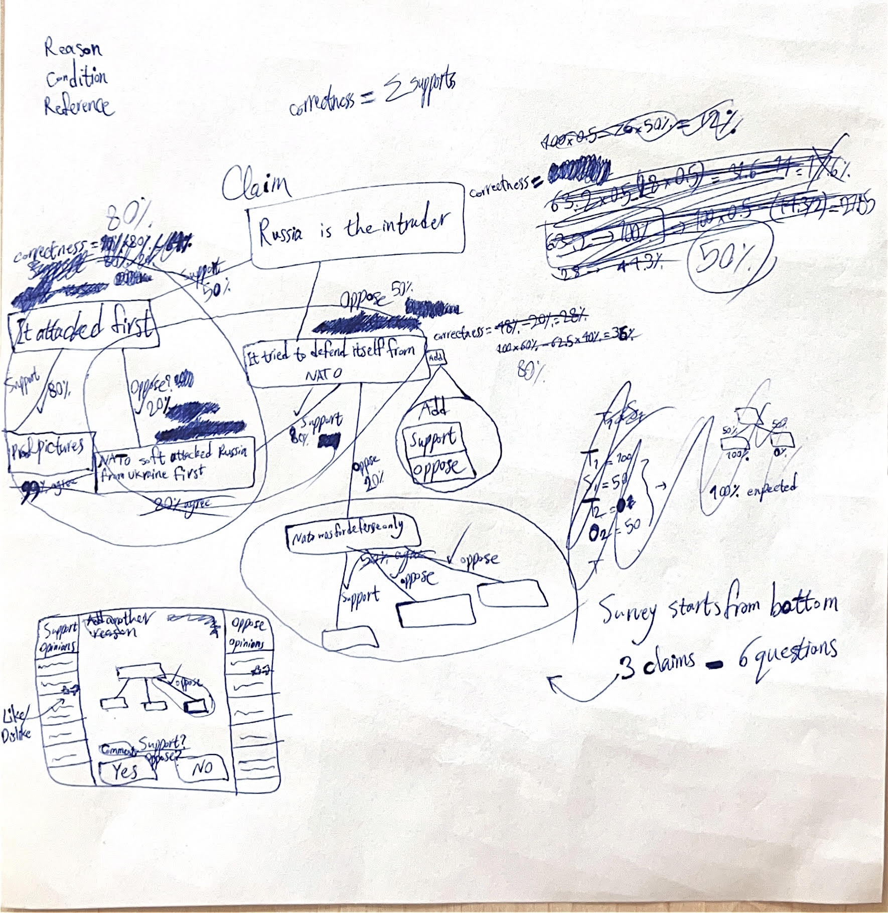

# TruthUncover
Reasoning platform

- A **claim** has many support reasons.
- A **claim** has many oppose reasons.
- Each of reasons has a connection to the claim that can be scored as effect.
- **APT** = Agree votes Per Total. Each connection has an APT value.
- Sum of all connections is 1.
- Each **connection effect** = APT of the connection / sum of APT of all connections to the claim.
- **Truth** percecntage of a claim = Sigma(support connection effect * truth rate of the support reason)
---
- A **solution**/**approach** consists of many claims inside it with additional fields for comments.
---
- Correctness of a **claim** is sum of its supports percentages:
  - A user can say Yes or No to the validity of connections.
  - The last bottom claims' truth is 100%.
  - A user can see comments for each connection when they want to vote.
  - Comments can be liked or disliked and are sorted by the likes value.
  - There is a survey for each claim, asking Yes or No for connections.
  - Upper level connections are calculated based on lower ones.
  - A user can add new support or oppose reasons to each claim.
  - Reasons with a lot of Noes will be archived (e.g. <4% APT). It means they do not effect the truth calculation and also are not shown.
  - New reasons are not taken into effect until they get an specific number of votes e.g. 100.
  - Users can report a reason as duplicate. Highly reported duplicated reasons will be archived.
  - Users can report a reason as ambiguous. Highly reported ambiguous reasons will be archived until author clarifies it more.

There is an example for recent world event (All numbers are just examples):

Example 1:

Example 2:

                             Reason 1
                                |
                                | oppose (10%)
                                |
                             Reason 2
         /                      |                     \
       / oppose (APT=60%)       | support (APT=80%)     \ support (APT=40%)
     /                          |                         \
Reason 3 (100% true)        Reason 4 (100%)               Reason 5 (100%)

Effect of Reason 3 = 60 / (60+80+40) = 33%
Effect of Reason 4 = 80 / (60+80+40) = 45%
Effect of Reason 5 = 40 / (60+80+40) = 22%

Truth of Reason 2 = (Reason 4 effect * Reason 4 truth) + (Reason 5 effect * Reason 5 truth) = (45 * 100) + (22 * 100) = 67%

Effect of Reason 2 = 10 / 100 = 10%

Truth of Reason 1 = 100% - (Reason 2 truth * Reason 2 effect) = 100% - (67% * 10%) = 93.3%
